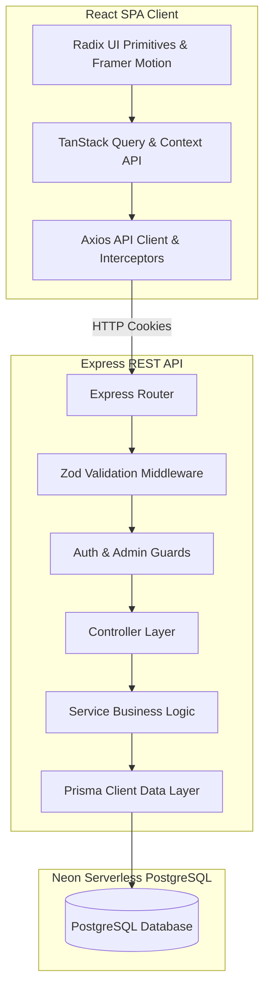

# UniWear Commerce — Enterprise-Grade Fashion Marketplace

A full-stack, production-quality fashion e-commerce marketplace built from scratch. Designed with modular Route-Controller-Service backend patterns, relational PostgreSQL persistence via Prisma ORM, and a React + TailwindCSS + Radix UI frontend.

---

## 🏛️ System Architecture

The project is structured under a decoupled monorepo workspace.



---

## 📁 Repository Layout

```
UniWear-Commerce/
├── docker-compose.yml              # Multi-container orchestration
├── package.json                    # Workspaces runner configurations
├── README.md                       # Documentation handbook
├── client/                         # React Frontend SPA
│   ├── src/
│   │   ├── components/
│   │   │   ├── ui/                 # Accessible Radix primitives
│   │   │   ├── layout/             # Navigation headers & footers
│   │   │   ├── products/           # Catalog grid, filters, and cards
│   │   │   └── shared/             # Spinner loaders, empty states, star rating
│   │   ├── contexts/               # Session & light/dark theme providers
│   │   ├── hooks/                  # useCart, useWishlist query mutations
│   │   ├── layouts/                # Protected routes & Admin dashboard frame
│   │   ├── lib/                    # Axios instance & utility calculations
│   │   ├── pages/                  # Customer-facing templates & admin controls
│   │   └── services/               # REST API service request mappings
│   └── package.json
└── server/                         # Node.js + Express Backend
    ├── src/
    │   ├── controllers/            # HTTP Request handlers
    │   ├── middleware/             # Role checking & parsing guards
    │   ├── routes/                 # Endpoint declarations
    │   ├── services/               # Core transaction business logic
    │   ├── tests/                  # Jest integration & unit test suites
    │   └── utils/                  # Cryptography, JWT, Cloudinary, Prisma
    ├── prisma/
    │   ├── schema.prisma           # Relational Postgres schema
    │   └── seed.ts                 # Catalog seeder seeder
    └── package.json
```

---

## 🛠️ Installation & Setup (Local Development)

### Prerequisites
* Node.js v20+
* Homebrew (Mac) or Docker

### 1. Database Setup
If using Docker, run:
```bash
docker-compose up -d db
```
If using local Homebrew Postgres:
```bash
brew install postgresql@15
brew services start postgresql@15
createdb uniwear
```

### 2. Configure Environments
Create a `.env` file in the `server` directory:
```env
PORT=5001
NODE_ENV=development
DATABASE_URL="postgresql://apple@localhost:5432/uniwear?schema=public"
JWT_SECRET="your-jwt-secret-key-for-development"
JWT_EXPIRES_IN="7d"
CLIENT_URL="http://localhost:5173"

# Google OAuth
GOOGLE_CLIENT_ID="your-google-client-id.apps.googleusercontent.com"
GOOGLE_CLIENT_SECRET="your-google-client-secret"
GOOGLE_CALLBACK_URL="http://localhost:5001/api/auth/google/callback"
```

### 3. Google OAuth Setup
1. Go to [Google Cloud Console](https://console.cloud.google.com).
2. Create a project and head to **APIs & Services** > **OAuth Consent Screen**.
3. Create an External consent screen, fill out app metadata, and add the `openid`, `email`, and `profile` scopes.
4. Head to **Credentials** > **Create Credentials** > **OAuth Client ID**.
5. Select Web Application:
   * **Authorized Javascript Origins:** `http://localhost:5173`
   * **Authorized Redirect URIs:** `http://localhost:5001/api/auth/google/callback`
6. Copy the Client ID and Secret and paste them into your `server/.env` file.

### 4. Deploy Migrations & Seed
Run migrations and populate the database:
```bash
npm run install:all
cd server
npx prisma migrate dev --name init
npx prisma db seed
```

### 5. Start Development Servers
Run both client and server concurrently from the root directory:
```bash
npm run dev
```
* **Frontend:** `http://localhost:5173`
* **Backend:** `http://localhost:5001`

---

## 🧪 Testing Suite
We utilize Jest to verify authorization and transaction integrity:
```bash
cd server
npm run test
```

---

## 👥 Demo Credentials
* **Admin User:** `admin@uniwear.com` / `password123`
* **Regular Customer:** `john@example.com` / `password123`

---

## 🔌 API Documentation

| Method | Endpoint | Auth | Description |
| :--- | :--- | :--- | :--- |
| **POST** | `/api/auth/register` | Public | Register new customer account |
| **POST** | `/api/auth/login` | Public | Authenticates credentials & sets secure cookies |
| **POST** | `/api/auth/logout` | Shopper | Clears authentication cookies |
| **GET** | `/api/auth/me` | Shopper | Returns current logged-in user context |
| **GET** | `/api/products` | Public | Returns paginated & filtered products |
| **GET** | `/api/products/:slug` | Public | Returns single product details |
| **POST** | `/api/products` | Admin | Adds product to catalog |
| **PUT** | `/api/products/:id` | Admin | Updates product properties |
| **DELETE** | `/api/products/:id` | Admin | Soft-archives target product |
| **GET** | `/api/cart` | Shopper | Fetches active user shopping cart |
| **POST** | `/api/cart/items` | Shopper | Adds item to shopping cart |
| **PATCH** | `/api/cart/items/:id` | Shopper | Updates target cart item quantity |
| **DELETE** | `/api/cart/items/:id` | Shopper | Removes item from cart |
| **POST** | `/api/orders` | Shopper | Places order & runs checkout transactions |
| **GET** | `/api/orders/:id` | Shopper | Returns tracking status & timeline |
| **PATCH** | `/api/orders/:id/status` | Admin | Updates order tracking status |
| **POST** | `/api/coupons/validate` | Shopper | Validates discount voucher rules |

---

## 🐳 Production Deployment Setup

### 1. Build and Run via Docker Compose
To build and run all services (DB, server, client) locally in production mode:
```bash
docker-compose up --build
```
* The client is served via Nginx on port `5173`.
* Nginx proxy-passes `/api` queries to the backend node server container.

### 2. Manual Cloud Deployments
* **Backend:** Deploy to Render using the server Dockerfile. Specify environment variables.
* **Frontend:** Deploy to Vercel/Netlify. Connect to the backend production API.
* **Database:** Provision a serverless PostgreSQL instance on Neon.tech.

---

## 🖼️ Application Viewports

| Main Catalog Filter (Sidebar) | Admin Analytics Dashboard (SVG charts) |
| :--- | :--- |
|  |  |

---

## 📈 Interview Talking Points

Be prepared to discuss these design patterns during the technical interview:
1. **Prisma ACID Transactions:** Explain how `$transaction` prevents race conditions by locking stock rows, verifying stock levels, updating usage counters, creating order models, and flushing carts atomically.
2. **Stateless JWT Cookie Authentication:** Discuss why `httpOnly` secure cookies are preferred over local storage to block Cross-Site Scripting (XSS) token reads.
3. **Axios Response Interceptors:** Detail how the frontend automatically logs out users by catching global `401 Unauthorized` responses.
4. **SVG Visualizations:** Explain how rendering charts natively in SVG reduces JavaScript bundle sizes by avoiding heavy visualization dependencies.

---

## ⚠️ Limitations & Future Roadmap
* **Simulated Payments:** Payments are simulated. Real-world implementations require Stripe webhook status listeners.
* **Elasticsearch / Meilisearch:** Text search uses Postgres `ILIKE` operations; larger catalogs would benefit from Elasticsearch synchronization.

---

## 🤖 AI Usage Statement
AI was utilized as an engineering accelerator to structure routes, boilerplate validation schemas, and database seed mock assets, allowing development focus to target transactional database integrity, authentication controls, and responsive UI layouts.
